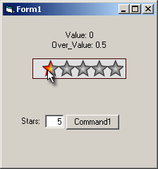



## A1: Star\-Like Rating Control \(like iTunes and Shockwave\)

### Description

Definately see screenshot. This is a iTunes/shockwave-style star-like rating system. I havent seen this (to my recollection) on PSC. This was developped for a custom DVD/Video management application. Set the MaxStars to 4, and use it to rate restaurants. Use (virtually) any number of stars and rate at an interval of 0.5.
 
### More Info
 

             |
---                |---
**Submitted On**   |2005-02-01 11:10:50
**By**             |[\[\]\)utch\[\]v\[\]aster](https://github.com/Planet-Source-Code/PSCIndex/blob/master/ByAuthor/utch-v-aster.md)
**Level**          |Intermediate
**User Rating**    |5.0 (25 globes from 5 users)
**Compatibility**  |VB 5\.0, VB 6\.0
**Category**       |[Custom Controls/ Forms/  Menus](https://github.com/Planet-Source-Code/PSCIndex/blob/master/ByCategory/custom-controls-forms-menus__1-4.md)
**World**          |[Visual Basic](https://github.com/Planet-Source-Code/PSCIndex/blob/master/ByWorld/visual-basic.md)
**Archive File**   |[A1\_\_Star\-L184662212005\.zip](https://github.com/Planet-Source-Code/utch-v-aster-a1-star-like-rating-control-like-itunes-and-shockwave__1-58612/archive/master.zip)

